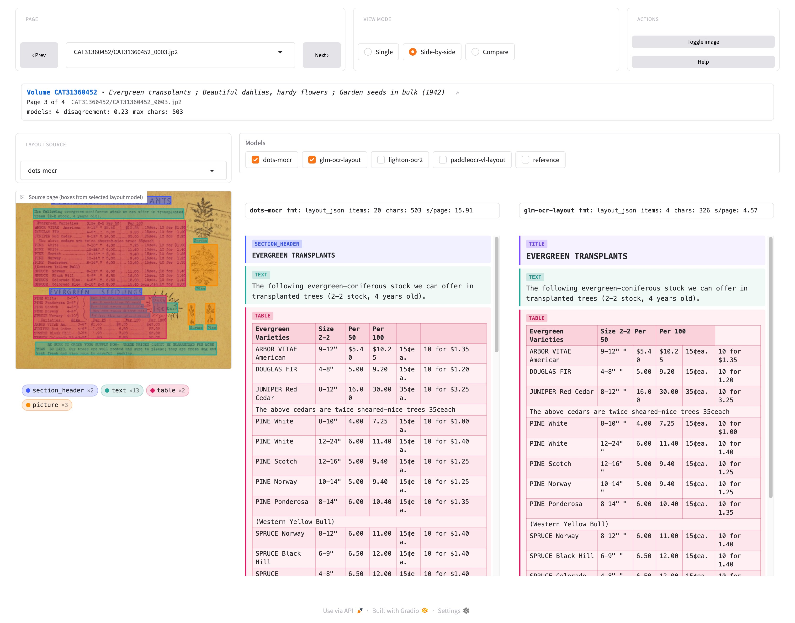

# ocrscout

**Find the right OCR model for your documents**



## Why this exists

A wave of vision-language OCR models has reset the bar set by [Tesseract](https://github.com/tesseract-ocr/tesseract) — dots-OCR, GLM-OCR, LightOnOCR, PaddleOCR-VL, RolmOCR, and a new one every few weeks. Which works best *depends on your documents*: a model that aces modern PDFs may stumble on a Victorian novel or German blackletter. Public benchmarks don't tell you what works on **your** corpus, and finding out by hand — install, configure vLLM, write glue, parse each model's custom output, time it — costs hours per model.

ocrscout turns "compare these models on my documents" into one command. It's a *scout*, not a production system: it helps you pick a model.

## Install

```bash
uv add ocrscout
```

One flat dependency list — PDF input, ALTO/hOCR parsing, cloud filesystems, the BHL adapter, the layout detector, vLLM, the LiteLLM proxy, the Gradio viewer, SkyPilot, jiwer — all installed by default, no `[extra]` flags. The trade-off is a ~2–3 GB install (mostly `torch` + `vllm`).

> **DGX-class hardware (ARM64 + CUDA)** needs a `torch` wheel from Nvidia's index that isn't on pypi. The `torch` requirement is intentionally unpinned to a source, so you can pre-install the right wheel and `uv sync` will respect it.

## Quick start

```bash
uv run ocrscout run --source ./images/ --models dots-mocr,glm-ocr-layout --sample 20
```

ocrscout loads each model onto your GPU, runs every page through it, normalises whatever it emits (markdown, HTML, custom token streams) into one common document model, and shuts down cleanly. Results land in `./data/results/` (the default `--output-dir`):

- `data/train-*.parquet` — one row per `(page, model)` with timings, token counts, success/failure, the normalized document, and a pre-rendered `markdown` column. Laid out like a HuggingFace dataset, so `datasets.load_dataset("./data/results", split="train")` works directly.
- `pipeline.yaml` — the resolved config, so the run reproduces via `ocrscout apply pipeline.yaml`.

Shards flush incrementally during the run, so a partial run is always readable and `--resume` picks up where it left off (per-model: a page done for model A is still attempted for model B).

**Scoring against a reference.** Point ocrscout at a reference adapter and it runs every applicable comparison per page — text similarity and CER/WER (via `jiwer`) always, document/layout deltas when both sides carry the data. References are *not* assumed to be ground truth; provenance (`method`/`engine`/`confidence`) flows through so you read the numbers correctly.

```bash
# Plain-text references on disk
uv run ocrscout run --source ./images/ \
                    --reference plain_text --reference-path ./txt/ \
                    --models dots-mocr,glm-ocr-layout

# BHL legacy OCR as reference, sampled from the open-data S3 bucket
uv run ocrscout run --source-name bhl --sample 20 \
                    --source-arg 'languages=["eng"]' \
                    --reference bhl_ocr --models lighton-ocr2
```

**Look at the results:**

```bash
uv run ocrscout inspect ./data/results/   # terminal summary + per-page dumps (good over SSH)
uv run ocrscout viewer ./data/results/    # browser viewer for visual comparison
```

## Bundled models

ocrscout ships eight curated profiles. Modern OCR models split into **layout-aware** (segment the page first, OCR each region; handle mixed content in one call) and **single-task** (one thing per call — smaller and faster, but their text mode flattens tables into prose). To get structure out of single-task models, ocrscout pairs them with an external layout detector ([PP-DocLayoutV3](https://huggingface.co/PaddlePaddle/PP-DocLayoutV3_safetensors)); profiles ending in `-layout` use this.

| Profile | Best for | Why |
| --- | --- | --- |
| `dots-ocr` | Mixed pages (text + tables + figures) | 1.7B, layout-aware, structured output with bounding boxes |
| `dots-mocr` | Same, more structured output | 3B, layout-aware; DocTags-format output |
| `lighton-ocr2` | Mixed pages, prefer Markdown | 1B; emits HTML tables inline in markdown |
| `glm-ocr` | Plain text pages, fast inference | 0.9B; pick text/table/formula mode per run |
| `glm-ocr-layout` | Mixed pages on a small GPU | GLM-OCR + layout detector; recovers structured tables |
| `paddleocr-vl` | Plain text pages, fastest in the zoo | 0.9B; ~5 s/page on a single GPU |
| `paddleocr-vl-layout` | Charts, formulas, and tables | Same model + layout detector; the only profile that recognizes charts |
| `rolm-ocr` | Plain text alternative | 7B; Reducto's RolmOCR — sometimes better on receipts/invoices |

**Adding a model.** Drop a YAML profile into `src/ocrscout/profiles/`. `uv run ocrscout introspect <name>` drafts one from the matching [`uv-scripts/ocr`](https://huggingface.co/datasets/uv-scripts/ocr) reference script. Or ship profiles from your own package via entry points.

## Running models

Every deployment runs the same stack — `ocrscout → LiteLLM proxy → one vLLM per model` — managed for you by a `Runner`. The LiteLLM proxy gives every model the same OpenAI-compatible URL and lets you mix local vLLM and hosted APIs (Gemini, Anthropic) in one run. Both daemons bind to `127.0.0.1` only, so the stack stays unreachable on a public-IP cloud GPU.

```bash
# Just run it — local stack up, pages run, stack down. Model-major by
# default: one vLLM at a time, so the GPU only has to fit the largest
# single model. --parallel-models N widens the chunk; --keep-up leaves
# the stack resident for follow-up submits.
uv run ocrscout run --source ./images/ --models dots-mocr,glm-ocr-layout --resume

# Stateful workflow — daemonised stack survives terminal close / SSH drop
uv run ocrscout launch --models dots-mocr,glm-ocr-layout
uv run ocrscout submit --source ./scans/ --output ./out/ --pages 1000 --resume
uv run ocrscout status        # reads ~/.ocrscout/state.yaml
uv run ocrscout logs <job-id>
uv run ocrscout down

# Scale to a Kubernetes pool via SkyPilot (OVHcloud / EKS / GKE / on-prem)
uv run ocrscout launch --runner skypilot --gpu L4 --workers 3 --models dots-mocr
uv run ocrscout submit --source s3://bucket/scans/ --output s3://bucket/out/ \
  --pages 8000 --num-jobs 10

# HuggingFace-sponsored compute — hf:// paths keep data on the Hub
uv run ocrscout run --runner hf --gpu L4 --models dots-mocr \
  --source hf://datasets/biodiversitylibrary/sample \
  --output hf://datasets/yourname/ocrscout-results

# Bring your own proxy — skip the Runner entirely
OCRSCOUT_VLLM_URL=http://my-proxy:4000/v1 uv run ocrscout run \
  --source ./images/ --models dots-mocr
```

The autoscaler sizes the vLLM KV-cache, region concurrency, and CPU detector pool from the detected GPU at launch, so layout-aware throughput scales across hardware without per-host tuning (e.g. `glm-ocr-layout` on a 240-page BHL sample: **0.50 s/page** on an H100, **2.18** on an L4). Override via `--gpu-budget`, `--batch-concurrency`, `--detector-workers`. Full sizing rules, daemon lifecycle, and Runner internals are in [CLAUDE.md](CLAUDE.md).

## Looking at results

- **`ocrscout inspect <out>`** — terminal summary table (with comparison metrics when present), zero extra deps. `--page <id>` dumps every model's output for a page; `--compare A,B [--comparison-type document]` shows a typed comparison (either side can be `reference`); add `--html` to serve a one-shot comparison page over your LAN.
- **`ocrscout viewer <out>`** — browser app with three modes: **Single** (one artifact, source page + bbox overlay), **Side-by-side** (any combination of models + reference in parallel columns), **Compare** (a prediction vs a baseline, stacking every applicable comparison — text diff, structural deltas, per-category bbox IoU). Keys: `j`/`k` pages, `1`/`2`/`3` modes, `i` toggles the image; view state lives in the URL for sharing.

## Extending

ocrscout discovers plugins via Python entry points — subclass an ABC, set a `name`, register in your own package without touching ocrscout's tree. Extension points: `SourceAdapter` (local/S3/GCS/HF/BHL built in), `ReferenceAdapter` (plain text, BHL OCR), `ModelBackend` (`litellm`, `layout_chat`, `tesseract`), `Runner` (`local`, `skypilot`, `hf`), `LayoutDetector` (PP-DocLayoutV3), `Normalizer`, `ExportAdapter` (parquet), `Comparison` + `ComparisonRenderer` (text / document / layout), `Benchmark`, `Reporter`. Full guide in [CLAUDE.md](CLAUDE.md).

## Logging

Every command takes `-q` (warnings + errors only), default (per-page progress, GPU allocation), `-v` (+ timestamps, full paths, GPU telemetry), `-vv` (+ subprocess command lines, source markers). Output is one logical line per record — safe to `grep`, paste into bug reports, or capture in CI.

## License

Apache 2.0 — see [LICENSE](LICENSE).
